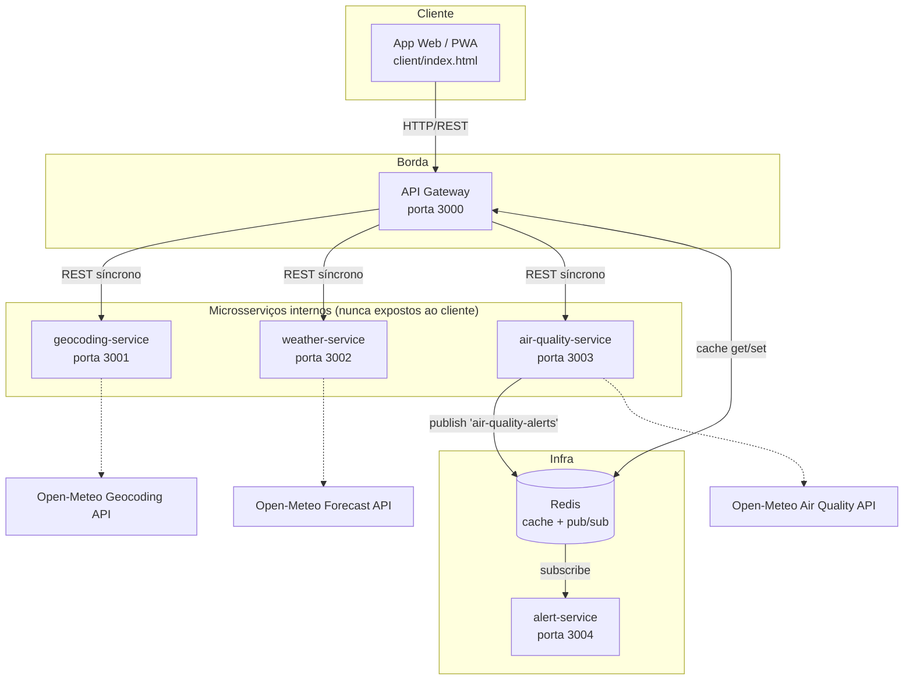

# Respira Urbana — Sistema Distribuído

Aplicativo de informações ambientais urbanas (clima + qualidade do ar) construído
como um sistema distribuído de verdade: um cliente, um API Gateway e três
microsserviços independentes, com cache compartilhado e um canal de eventos
assíncrono.

## Arquitetura



### Por que isso é um sistema distribuído, e não só "vários arquivos"

- **Processos independentes**: cada serviço roda no seu próprio container/processo Node,
  com seu próprio `package.json`, e pode ser reiniciado, escalado ou substituído sem
  tocar nos outros.
- **Duas formas de comunicação**:
  - **Síncrona (REST)**: Gateway → geocoding/weather/air-quality. Chamadas em paralelo
    via `Promise.allSettled` — uma falha não derruba a outra.
  - **Assíncrona (Pub/Sub)**: `air-quality-service` publica um evento no Redis quando o
    índice de qualidade do ar passa de um limite; `alert-service` consome esse evento
    sem que os dois serviços se conheçam ou estejam no ar ao mesmo tempo.
- **Estado compartilhado explícito**: o cache no Redis é a única coisa que os serviços
  dividem, e é acessado por rede — não por memória compartilhada.
- **Tolerância a falha parcial**: se `weather-service` cair, o Gateway ainda responde com
  os dados de qualidade do ar (ou com o último valor em cache), e o cliente mostra isso
  na interface (`status.weather = "cache"` / `"unavailable"`).
- **Nenhum ponto único de conhecimento**: o cliente só conhece o Gateway; o Gateway não
  sabe que existe um `alert-service`; o `alert-service` não sabe que existe um Gateway.

## Estrutura de pastas

```
respira-urbana-distributed/
├── docker-compose.yml        # orquestra tudo (Redis + 5 serviços + client)
├── .env.example               # variáveis para rodar sem Docker
├── client/
│   └── index.html              # app web, fala só com o api-gateway
└── services/
    ├── api-gateway/            # porta 3000 — orquestração + cache
    ├── geocoding-service/       # porta 3001 — nome de cidade → coordenadas
    ├── weather-service/         # porta 3002 — clima atual
    ├── air-quality-service/     # porta 3003 — qualidade do ar + publica alertas
    └── alert-service/           # porta 3004 — consome alertas (Pub/Sub)
```

## Rodando com Docker (recomendado)

Pré-requisito: Docker e Docker Compose instalados.

```bash
cd respira-urbana-distributed
docker-compose up --build
```

Isso sobe: Redis, os quatro microsserviços, o Gateway e um Nginx servindo o cliente.

- App: **http://localhost:8080**
- Gateway: **http://localhost:3000** (`/health`, `/api/geocode?q=`, `/api/environment?lat=&lon=`)
- Cada serviço interno também expõe `/health` na sua porta (3001–3004), útil para debug.

Para derrubar tudo: `docker-compose down` (adicione `-v` para limpar o Redis também).

## Rodando manualmente em uma IDE (sem Docker)

Útil para debugar um serviço de cada vez com breakpoints.

Pré-requisitos: Node.js 18+ e um Redis local (`redis-server`, ou `docker run -p 6379:6379 redis:7-alpine`).

1. Copie `.env.example` para `.env` e ajuste se necessário.
2. Abra um terminal por serviço (a IDE facilita isso — ex.: painéis de terminal do VS Code):

```bash
# Terminal 1
cd services/geocoding-service && npm install && npm run dev

# Terminal 2
cd services/weather-service && npm install && npm run dev

# Terminal 3
cd services/air-quality-service && npm install && npm run dev

# Terminal 4
cd services/alert-service && npm install && npm run dev

# Terminal 5
cd services/api-gateway && npm install && npm run dev
```

3. Sirva `client/index.html` com qualquer servidor estático (ex.: extensão "Live Server"
   do VS Code, ou `npx serve client`). Se o Gateway não estiver em `localhost:3000`, abra
   o app com `?gateway=http://SEU_HOST:PORTA` na URL.

## Testando cada serviço isoladamente

```bash
curl "http://localhost:3001/geocode?q=Botucatu"
curl "http://localhost:3002/weather?lat=-22.88&lon=-48.44"
curl "http://localhost:3003/air-quality?lat=-22.88&lon=-48.44"
curl "http://localhost:3000/api/environment?lat=-22.88&lon=-48.44&place=Botucatu"
curl "http://localhost:3004/last-alert"
```

Para forçar um alerta e ver o `alert-service` reagir nos logs, baixe temporariamente
`AQI_ALERT_THRESHOLD` no `air-quality-service` (ex.: para `1`) e refaça a consulta —
qualquer cidade vai disparar o evento.

## Simulando falha de um serviço (para ver a tolerância a falhas)

```bash
docker-compose stop weather-service
curl "http://localhost:3000/api/environment?lat=-22.88&lon=-48.44&place=Botucatu"
# resposta ainda vem, com status.weather = "cache" (se já houver algo salvo) ou "unavailable"
docker-compose start weather-service
```

## Possíveis evoluções

- Trocar Redis por um message broker dedicado (RabbitMQ/Kafka) se o volume de eventos crescer.
- Adicionar um service registry (Consul) em vez de URLs fixas por variável de ambiente.
- Colocar o Gateway atrás de um load balancer com múltiplas réplicas.
- Persistir alertas em um banco em vez de só logar (`alert-service`).
- Empacotar o `client/` como app móvel real (React Native / Capacitor) apontando para o Gateway.
